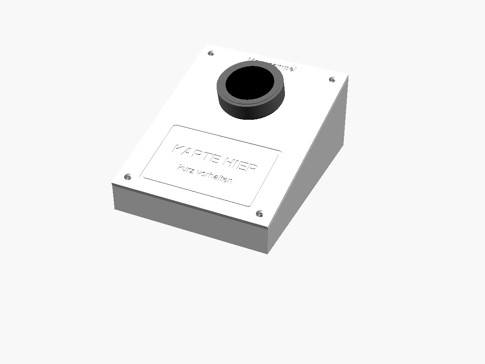
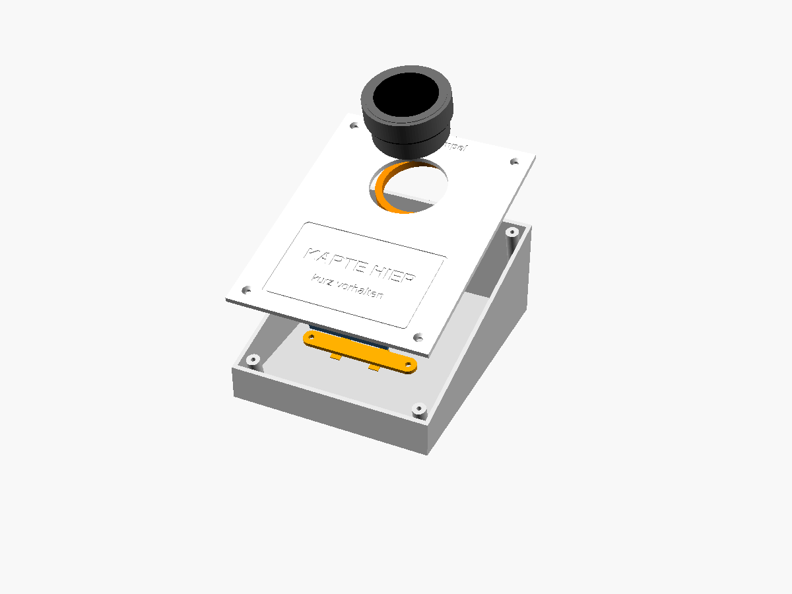
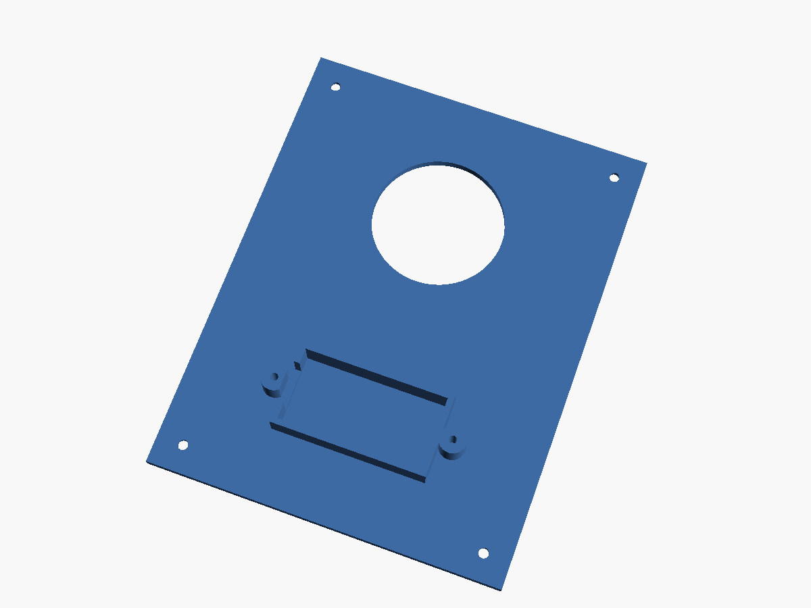
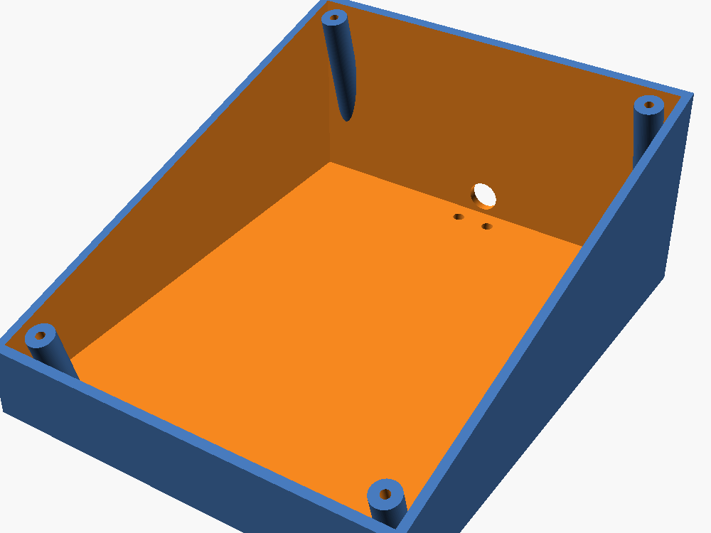

# Gehäuse: Tischkonsole für Dial und Kartenleser

Die Konsole steht drinnen neben der Ausgabe. Oben ist das M5Stack Dial mit seiner eigenen orangen Überwurfmutter eingeschraubt, davor die feste Kartenfläche „KARTE HIER“. Unter der Kartenfläche ist die **RFID2 Unit fest eingebaut**. Sie ist der Kartenleser der Konsole und keine Alternative zum eingebauten Leser des Dial. Die Software bleibt unverändert (Leserwahl „Automatisch“): Sobald die RFID2 an PORT.A steckt, liest das Dial über sie.

## Teile

| Teil | Anzahl |
|---|---|
| M5Stack Dial v1.1 (K130-V11) | 1 |
| M5Stack Unit RFID2 (U031-B) mit beiliegendem Grove-Kabel (20 cm) | 1 |
| USB-C-Kabel (am besten mit 90°-Winkelstecker) und 5-V-Netzteil | 1 |
| Senkkopfschraube M3 × 10 (Deckplatte auf Unterteil) | 4 |
| Schraube M3 × 8 (Haltebügel der RFID2) | 2 |
| Gummifüße Ø 10 mm | 4 |
| Kabelbinder (Zugentlastung) | 1 |

## Druckdateien

| Datei | Inhalt | Lage beim Druck |
|---|---|---|
| `deckplatte.stl` | Oberseite mit Dial-Loch (Ø 45,2 mm), Kartenfläche und RFID2-Tasche (≈ 69 g) | Oberseite nach unten (so exportiert) |
| `unterteil.stl` | Wanne mit Schraubdomen, Kabelloch und Fußmulden (≈ 137 g) | stehend, Boden unten |
| `rfid_halter.stl` | Haltebügel für die RFID2 | flach |
| `passtest.stl` | runder Plattenausschnitt (Ø 70 mm) mit Dial-Loch | wie Deckplatte |

PETG oder PLA, 0,2 mm Schichthöhe, 3 Wände, 20 % Füllung, **keine Stützen**. Die Maße stehen oben in `mensaampel-gehaeuse.scad` und lassen sich in OpenSCAD anpassen; einzelne Teile mit `-D 'teil="deckplatte"'` usw. exportieren.

**Zuerst `passtest.stl` drucken** (ca. 15 Minuten) und das Dial damit einschrauben. Erst wenn es sauber sitzt, die großen Teile drucken.

## Zusammenbau

1. RFID2 mit der Antennenseite nach oben in die Tasche unter „KARTE HIER“ legen, das Grove-Kabel Richtung Dial führen. Haltebügel mit 2 × M3 × 8 festschrauben.
2. Die orange Überwurfmutter unten vom Dial abschrauben. Dial von oben durch das Loch der Deckplatte stecken, bis der Kragen aufliegt.
3. Display gerade ausrichten und die Mutter von unten wieder aufschrauben, **handfest** anziehen (kein Werkzeug). Der Drehknopf muss danach frei drehen.
4. Grove-Kabel der RFID2 an **PORT.A** auf der Rückseite des Dial stecken (nur stromlos stecken), USB-C-Kabel seitlich einstecken.
5. Kabel durch das hintere Loch im Unterteil führen, mit dem Kabelbinder an den beiden Ösen zugentlasten.
6. Deckplatte mit 4 × M3 × 10 auf das Unterteil schrauben, Gummifüße einkleben.
7. Einschalten. Unter Gerät muss „Automatisch – aktiv: extern“ stehen. Danach die Abnahme aus `ANLEITUNG-DIAL.md` durchgehen.

## Am echten Gerät prüfen

Die Maße stammen aus den offiziellen M5Stack-Modellen (github.com/m5stack/M5_Hardware), das Gehäuse ist aber noch nicht mit echter Hardware gedruckt worden. Beim Passtest prüfen:

- **Dial-Loch:** Das Gewinde (Ø 44 mm) geht leicht durch, der Kragen (Ø 48 mm) liegt mit seinem Dichtring auf, die Mutter greift und zieht fest. Ist das Loch zu eng, `dial_loch_d` erhöhen.
- **Drehknopf** schleift nicht auf der Platte (1,6 mm Luft laut Modell).
- **Lesereichweite** durch 1,5 mm Kunststoff: Karte flach auflegen, sie muss sicher gelesen werden. Wenn nicht, `rfid_restwand` auf 1,0 mm verringern.
- **Welcher Grove-Anschluss PORT.A ist** (auf der Rückseite beschriftet). An PORT.B arbeitet die RFID2 nicht.
